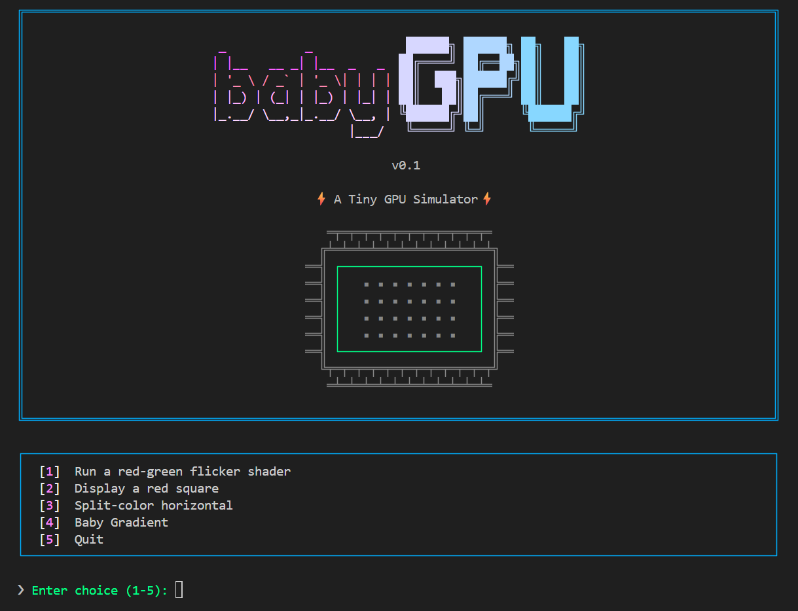

# babyGPU



babyGPU is a work in progress (and very early stage) educational GPU instructions simulator built in C. At the moment the hardware-side is simulated using C-code (rather than building from first principles and gates), so the main learning aspect is around using  assembly-like instructions to manipulate the GPU memory and write to buffer. Right now, I'm trying to have a basic simulation of SIMT execution, 32 thread warps, register files per-lane, basic code memory and abiltiy to load a shader into the fake ram of our GPU.

Runs only on windows. Have not spent any time on the build side of things. All disclaimers apply.

## In place
- Logical separation of "hardware", "driver", "application"
- Ability to write, assemble and run basic fragment shaders ; uncdotional jumps and labels are in place
- Non-turing complete assembly (missing conditional jumps, etc...)
- Basic ISA, "compiler", and "GPU core"
- Actual display is abstracted to a GLFW + OpengGL 1.1 texture on which we paint our pixel buffer (for simplicity)
- Basic assembler for "assembly-like" shaders, reading from external files (comment stripping, tokenization, error messages)

## Registers
At the moment babyGPU only has 10 registers (but the plan is to add support for more flexible number of registers going forward)
- **R0_COLOR_OUT**: this is a special register where the screen buffer is read (i.e., colors per pixel)
- **R1**: this is initalized with scaled x coordinates (640x480 fixed res)
- **R2**: this is initalized with scaled y coordinates
- **R3-R9**: these are free registers

## ISA Operations

### Load
**MOV_LOW_IMM8** - *Load value into bottom 8 bits (preserve top)* - MOV_LOW_IMM8, DST, IMM8  
**MOV_HIGH_IMM8** - *Load value into top 8 bits (preserves bottom)* - MOV_HIGH_IMM8, DST, IMM8  
**LDC** - *Load constant into destination register, constant is defined in application* - LDC, DST, IMM8  
**LDI** - *Load immediate value into destination* - LDI, DST, IMM8  

### Move
**MOV** - *Move value from one register to another* MOV, DST; SRC0

### Arithmetics
**ADD** - *Add 2 registers together and store in the destinaton one* - ADD, DST, SRC0, SRC1  
**ADDI** - *Add the value of 1 register and an immediate (8-bit) and store into destination register* - ADDI, DST, SRC0, IMM8  
**MULT** - *Multiply 2 registers together and store in the destinaton one* - MULT, DST, SRC0, SRC1  
**MULTI** - *Multioply the value of 1 register and an immediate (8-bit) and store into destination register* - MULTI, DST, SRC0, IMM8   
**DIV** - *Divide 2 registers together and store in the destination one ; division by 0 not allowed* - DIV, DST, SRC0, SRC1    
**DIVI** - *Divide the value of 1 register and an immediate (8-bit) and store into destination register ; division  by 0 not allowed* - DIVI, DST, SRC0, IMM8 

### Logic
SLT

### Branching
JMP

### Store
STORE_PIXEL

### End
END

## babyASM language
You can write shaders for babyGPU (only fragment shaders right now!) using the isa described above.
Syntax is simply an opcode followed by the register references. Anything after a semi-colon is ignored by the assembler:
```asm
OPCODE, DST, SRC0, SRC1_OR_IMM8 ;this is a comment
```

You can call constants ("uniforms") in your main program like-so:
```C
gpu_set_constant(dev, 0, 0xFF0000FF); //set constant 0 as red
```
And then use them in your assembly code:
```asm
LDC, R3, 0 ;load constant 0 into registry R3
```

A valid babyASM program writes the computed pixels to R0 and calls STORE_PIXEL and ends:
```asm
MOV, R0_COLOR_OUT, R3
STORE_PIXEL
END
```

Here is an example of a full shader program: 

```asm
LDC, R7, 0              ;load color from constant 0
MOV, R0_COLOR_OUT, R7   ;move our color to R0
STORE_PIXEL             ;store pixels from R0
END
```

I am slowly adding some additional features to the language (and will make it turing complete); but effectively you can also do unconditional jumps and use labels:
```asm
    LDC, R0_COLOR_OUT, 0      ; Load red from constant[0] (assume its set to red)
    JMP, skip_green           ; Jump over the green color
    LDC, R0_COLOR_OUT, 1      ; Load green from constant[1] (assume its set to green)- SHOULD BE SKIPPED 
skip_green:
    STORE_PIXEL
    END
```

## Sample programs
1. Flicker shader
2. Red Square
3. Horizontal color-split
4. Green gradient  
(more to come...)

## How to build
Check out quick_build_and_launch.bat (or the tasks.json for vscode) ; haven't put much thought into it up until now, so its basically just working on my local setup.

## Immediate To dos
- Add JNZ
- Add masking for conditional execution across threads
- Consider floats


